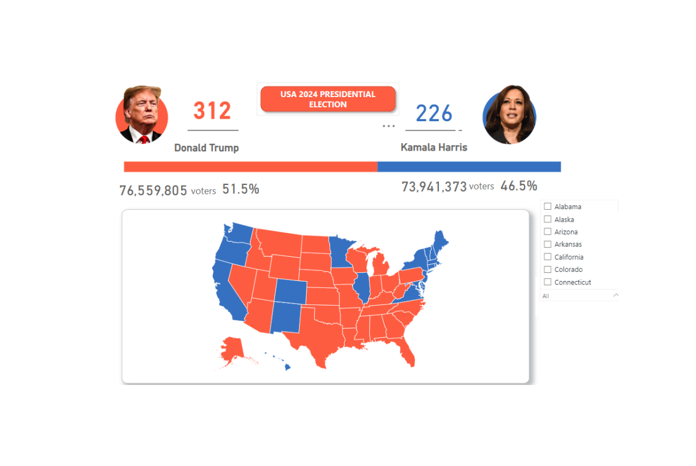

<!--Section 1: Introduce your self-->
## ABOUT ME

Hello! I'm Ozoagu Juliet 🤓, Graduate Student of Prosthetist & Orthotist|| Actively Seeking Internship Opportunities in Data Science and AI|| Researcher||Women Techsters Fellow '2024 || Analytic in Business, Finance, Health & More 

<!--Mention your top/relevant skills here - core and soft skills-->
## SKILLS

*As a data enthusiast, I seek and utilize every opportunity to hone my skills in data analytics, data science, machine learning (ML), artificial intelligence (AI), and robotics .*

**✅Data Analysis & Statistics**

•	Data Gathering

•	Data cleaning and Transformation

•	Data Wrangling

•	Exploratory Data Analysis (EDA)

•	Statistical Inference (e.g., hypothesis testing, confidence intervals)

•	Regression Analysis (linear, logistic)

**✅Data Visualization**

•	Data Storytelling

•	Interactive Dashboards (Power BI)

•	Advanced Excel Charting

•	Matplotlib / Seaborn (Python)

**✅Programming & Scripting** 

•	Python for Data Analysis (Pandas, NumPy, Scikit-learn)

•	R Programming (tidyverse, ggplot2)

•	SQL Mastery (joins, window functions, CTEs, subqueries)

<!--Section 2: List 3-4 key projects-->
## MY PROJECTS

*A glimpse of some of the projects I've been working on.*

**"I analyzed the Profit and Loss (P&L) financial data of 67 Capital LTD from 2020 to 2023 and provided strategic recommendations**

In today’s competitive financial landscape, understanding the intricacies of Profit and Loss (P&L) statements is essential for informed decision-making and strategic planning. This project aims to analyze the P&L statements of 67 Capital Ltd across six branches in South-South Nigeria from 2020 to 2023.
[Read More](https://www.linkedin.com/feed/update/urn:li:activity:7272214331436531712/)

**Providing Insights from the 2024 Dataset on the USA Presidential Election**

The 2024 United States Presidential Election dataset offers valuable insights into the political landscape, voter demographics, and election outcomes. This analysis aims to explore trends, patterns, and critical data points that shaped the election. By examining the dataset, we seek to understand the 
[Read More](https://www.linkedin.com/pulse/predictive-modeling-hypothesis-testing-using-titanic-dataset-anietie/)

**Immunization Coverage Report Agbagbo Ahwa imezi**

This report presents a monitoring and evaluation analysis of the immunization coverage in 
Agbagbo Awha Imezi, focusing on vaccination numbers, missed appointments, and stock-out 
days among 0-18 years children who received immunization at Agbagbo Awha Imezi PHC in 
Ezeagu LGA in Enugu State for two months (January and February). With a total of 9,370 
individuals vaccinated, the average immunization coverage rate stood at 97%. Despite this 
high coverage, the data reveals several challenges, such as significant vaccine stock-out days of 
12, high missed appointments of 250, and regional disparities in service delivery. These 
insights call for strategic improvements in logistics, communication (sensitization) and regional 
engagement. 

 

<a href="17 How to Present Data to Executives by Anietie Etuk.pdf">Download the Report here (pdf file)</a>

## CONTACT DETAILS

*Let’s connect and see how we can make a difference together!*
<table>
  <tbody>
    <tr>
      <td>📧</td>
      <td><a href="mailto:julietoluchi13@gmail.com">julietoluchi13@gmail.com</a></td>
    </tr>
    <tr>
      <td>📞</td>
      <td>(234) 813-705-9871</td>
    </tr>
    <tr>
      <td>📍</td>
      <td>Lagos, Nigeria</td>
    </tr>
    <tr>
      <td>⬇️</td>
      <td><a href="https://etuk123456.github.io/portfolio1/docs/Profile.pdf">Download my CV</a></td>
    </tr>
    <tr>
      <td>🌐</td>
      <td><a href="https://www.linkedin.com/in/julietoluchidataanalytics/">The things I do daily on LinkedIn</a></td>
    </tr>
    <tr>
      <td>📺</td>
      <td><a href="https://www.youtube.com/@julietoluchi4565">Watch my tutorials on YouTube</a></td>
    </tr>
  </tbody>
</table>

   

